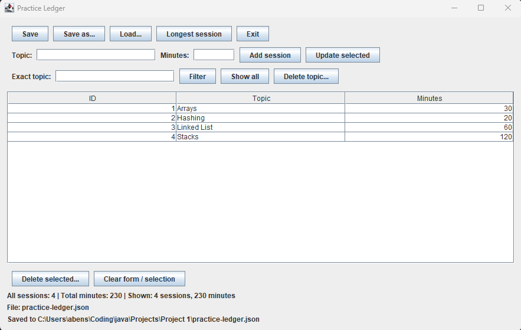

# Practice Ledger

A Java desktop application for tracking coding-practice sessions. Users can record topics and minutes, manage sessions, and save their progress to JSON.

## Features

- Add, edit, and delete sessions with stable IDs.
- Filter sessions by topic, ignoring capitalization.
- View total practice time and the longest session.
- Sort sessions by clicking table column headers.
- Delete all sessions for a topic after confirmation.
- Save and load JSON files.
- Receive validation messages for invalid input.
- Receive prompts before discarding unsaved changes in the GUI.

## Requirements

- Java 17 or later.
- Gson, configured as a project dependency.
- VS Code with Java support for the setup described below.

## Running the application

1. Open the project folder in VS Code.
2. Ensure the Gson JAR is in `lib` and included under Referenced Libraries.
3. Open `LedgerGui.java`.
4. Click **Run** above its `main` method.
5. Click **Load** to open an existing saved ledger, or add new sessions.

Click **Add session** or **Update selected** to apply form edits before saving.

The GUI starts empty and does not automatically load a file. Save defaults to `practice-ledger.json` in the program's working directory. **Save as** lets you choose another location.

For the terminal interface, run `Main.java`. The current terminal version saves and loads `ledger-test.json`; it does not automatically save or warn about unsaved changes when exiting.

## Project structure

| File | Responsibility |
|---|---|
| `Session.java` | Immutable session data and value validation |
| `PracticeLedger.java` | Session management, queries, and restoration validation |
| `LedgerFileStore.java` | JSON conversion and file access |
| `LedgerGui.java` | Desktop interface and user interaction |
| `Main.java` | Terminal interface |
| `PersistenceCheck.java` | Save/load round-trip checks |
| `PersistenceFailureCheck.java` | Invalid-input and file-error checks |

## Testing

Run the `main` method in each persistence test class.

The checks cover saving and loading, preserving the next ID, missing files, malformed JSON, negative minutes, and restoring an empty ledger. Failure tests check that existing ledger data remains unchanged.

`PersistenceCheck` creates or overwrites `ledger-roundtrip-test.json` in the working directory. Keep this test file separate from personal session data.

## Design decisions

- Sessions are immutable. Editing replaces a session while preserving its ID.
- IDs are independent of list positions, so deleting or sorting entries does not change their identities.
- Lists returned to callers are copies, preventing callers from directly modifying the ledger's internal list.
- Incoming saved state is validated before replacing the current ledger.
- The next ID is saved separately so deleted IDs are not reused after restarting.
- Application logic is separate from the interface, allowing both terminal and desktop interfaces to use it.

## Current limitations

- Data is stored locally in JSON files.
- Saving is explicit; changes are not automatically saved.
- The application does not coordinate simultaneous edits from multiple running instances.

## Learning focus

This project practices Java collections, encapsulation, immutability, exception handling, algorithm complexity, automated checks, JSON persistence, and event-driven interfaces.